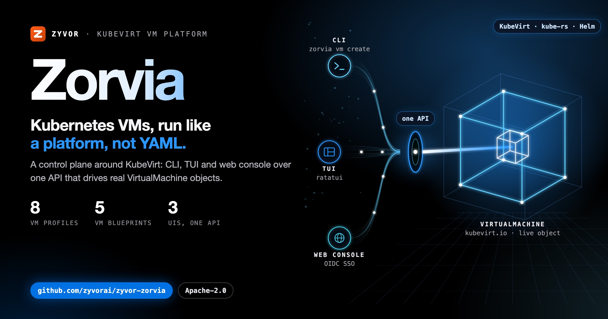
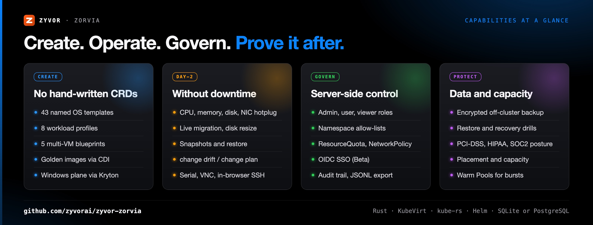
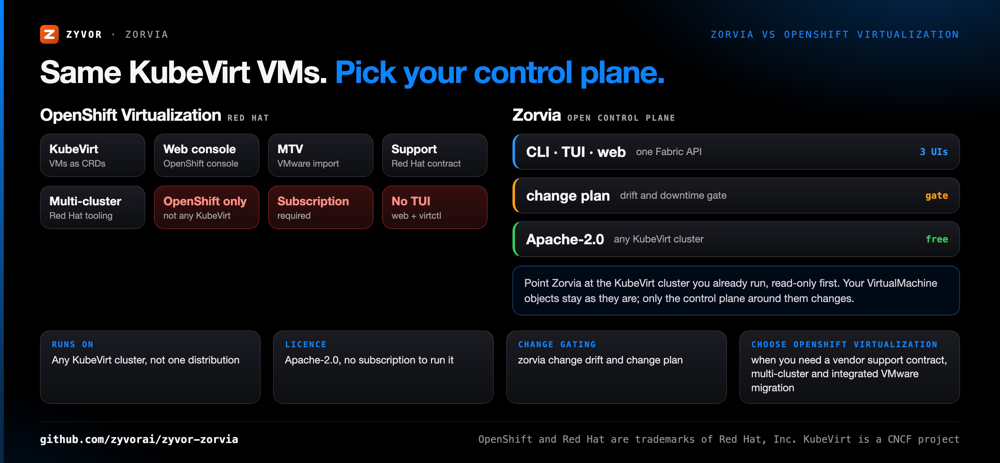
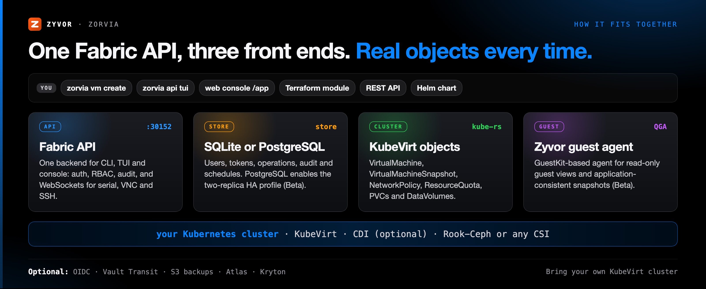

<div align="center">

# Zorvia

[](https://github.com/zyvorai/zyvor-zorvia/actions)
[](LICENSE)
[](CHANGELOG.md)
[](https://kubevirt.io/)
[](https://www.rust-lang.org/)

[](https://zyvor.dev/schedule?utm_source=github&utm_medium=zorvia&utm_campaign=readme_hero)
[](https://zyvor.dev/poc?utm_source=github&utm_medium=zorvia&utm_campaign=readme_hero)
[](#quickstart)

[**Quickstart**](#quickstart) · [**Console**](#see-it-live) · [**Docs**](docs/README.md) · [**Leaving OpenShift?**](docs/leave-openshift.md) · [**Star on GitHub**](https://github.com/zyvorai/zyvor-zorvia)



### Kubernetes VMs, run like a platform — not a pile of YAML.

**KubeVirt gives you `VirtualMachine` objects. Zorvia gives you the control plane around them.** CLI, interactive TUI and a signed-in web console — one API, live cluster objects, not a parallel mock store.

**43 OS templates** · **8 profiles, 5 blueprints** · **CLI · TUI · web, one API** · **Any KubeVirt cluster** · **Apache-2.0**

</div>

---

## What's new

**v0.4.0, the production-platform release** ([changelog](CHANGELOG.md)):

| Area | What shipped |
|---|---|
| Data protection you can prove | Encrypted off-cluster S3 backups with read-back verification, restore (including Block volumes), recovery drills, durable operations that survive restarts |
| Identity and tenancy | Namespace allow-lists for users and API tokens, TOTP secrets sealed at rest (local key or Vault Transit), OIDC group-to-role mapping, certificate hot reload |
| High availability (Beta) | PostgreSQL store (users, operations, audit, schedules, shared lockout) and a two-replica Helm profile (`values-ha.yaml`) |
| Guests | Zyvor guest agent (GuestKit v1.2.5) with application-consistent snapshots, read-only guest views, a Guest agent tab |
| Hardware (Experimental) | GPU/vGPU/SR-IOV passthrough, NUMA/hugepages/dedicated CPUs, permit/remove devices from the console |
| Upgrade note | The CLI is restructured into nested subcommands (breaking): `zorvia create` is now `zorvia vm create` |

## Why Zorvia

**Create** from a template or blueprint instead of hand-writing CRDs. **Operate** day-2 — hotplug, live migrate, snapshot — without downtime. **Reach** the guest over an authenticated console, VNC or SSH. **Govern** with real RBAC and quotas. **Prove** it afterward with an exportable audit trail. Full docs: [zyvorai.github.io/zyvor-zorvia](https://zyvorai.github.io/zyvor-zorvia/).

| When this happens… | Zorvia gives you… |
|---|---|
| Every new VM means hand-writing a `VirtualMachine` CRD | 43 named OS templates, 8 resource profiles and 5 multi-VM blueprints |
| Day-2 changes mean downtime or a careful `virtctl` session | CPU/memory/disk/NIC hotplug, live migration and disk resize, with `zorvia change drift` and `zorvia change plan` to catch problems first |
| Reaching the guest means handing out cluster credentials | Serial, VNC and in-browser SSH over authenticated, permission-checked WebSockets |
| Access control lives only in the UI | Server-side roles, per-user [namespace allow-lists](docs/TENANCY.md), `ResourceQuota` and `NetworkPolicy` — not client-only checks |
| The auditor asks who did what | A persistent audit DB and `GET /api/audit/export` (JSONL) for SIEM shippers |
| You're paying for OpenShift just to run KubeVirt VMs | An Apache-2.0 control plane for any KubeVirt cluster, adopted read-only first |

| Step | Surface | What it does |
|------|---------|--------------|
| **1 · Create** | Templates · profiles · blueprints | 43 OS templates, workload profiles, multi-VM stacks — no hand-written VM CRDs |
| **2 · Day-2** | Hotplug · migrate · snapshot | CPU/memory/disk/NIC hotplug, live migration, snapshots, disk resize |
| **3 · Access** | Console · VNC · SSH | Authenticated WebSockets into the guest from the signed-in console |
| **4 · Guard** | RBAC · namespaces · quotas · NetworkPolicy | Server-side roles, per-user [namespace allow-lists](docs/TENANCY.md), `ResourceQuota`, `NetworkPolicy` — not client-only checks |
| **5 · Audit** | Trail · JSONL export | Persistent audit DB + `GET /api/audit/export` for SIEM shippers |



### What is in the box

<table>
<tr>
<td valign="top" width="33%">
<b>Ship it</b><br>
43 named OS templates, 8 resource profiles and 5 multi-VM blueprints (LAMP, 3-tier, k8s-cluster, CI/CD, dev-stack). No hand-written VM CRDs.<br>
<a href="docs/profiles-blueprints-templates.md">Profiles, blueprints, templates</a>
</td>
<td valign="top" width="33%">
<b>Run day-2 without downtime</b><br>
Hotplug CPU, memory, disk and NIC; live migration; disk resize. <code>zorvia change drift</code> and <code>zorvia change plan</code> catch problems before they ship.<br>
<a href="docs/day-2-ops.md">Day-2 commands</a>
</td>
<td valign="top" width="33%">
<b>Reach the guest</b><br>
Serial, VNC and in-browser SSH with a real pty, all over authenticated WebSockets, from the same signed-in console.<br>
<a href="docs/console-and-api.md">Web console and API</a>
</td>
</tr>
<tr>
<td valign="top" width="33%">
<b>Govern who can</b><br>
Admin, user and viewer accounts; server-side <code>ResourceQuota</code> and <code>NetworkPolicy</code> CRUD; opt-in OIDC SSO (Beta).<br>
<a href="docs/OIDC.md">OIDC SSO</a>
</td>
<td valign="top" width="33%">
<b>Prove it, protect it</b><br>
Persistent audit trail with JSONL export, compliance posture against actual VM specs (PCI-DSS, HIPAA, SOC2), VolumeSnapshots and scheduled backups.<br>
<a href="docs/whats-inside.md">What is inside</a>
</td>
<td valign="top" width="33%">
<b>Fit more VMs, spend less</b><br>
Placement Advisor and Capacity Planning against real Node capacity, a Resource Optimizer, and Warm Pools for burst capacity.<br>
<a href="docs/platform-surface.md">Platform surface</a>
</td>
</tr>
</table>

---

## Zorvia vs OpenShift Virtualization



| | **Zorvia** | **OpenShift Virtualization** (Red Hat) |
|---|---|---|
| VM engine | KubeVirt | KubeVirt |
| Where it runs | Any KubeVirt cluster | OpenShift only |
| Licence | Apache-2.0, no subscription to run it | Red Hat subscription |
| Front ends | CLI, interactive TUI and web console on one Fabric API | OpenShift web console and `virtctl`; no TUI |
| Change gating | `zorvia change drift` and `zorvia change plan` built in | Not built in |
| VMware migration | No importer of its own in production; pairs with Transiva → h2kvm → GuestKit (in-product h2kvm import is Experimental) | Integrated migration tooling |
| Support | Production support and SLAs by contract, on top of the free code | Red Hat support contract |
| **Choose OpenShift Virtualization when** | | You want one vendor support contract for the whole platform, multi-cluster management and integrated VMware migration |

### How it stacks up

|  | Hand-rolled `kubectl`/`virtctl` | Generic K8s dashboards | OpenShift Virtualization | **Zorvia** |
|---|---|---|---|---|
| VM create/day-2 without hand-written YAML | No | Partial: view-only for VMs | Yes | Yes |
| Same capability from CLI, TUI, *and* web | No | No (web only) | Partial: web + `virtctl`, no TUI | Yes |
| Cost/right-sizing, compliance, HA built in | No | No | Partial: add-ons | Yes: real, on by default |
| Drift detection + change-plan gating | No | No | No | Yes (`zorvia change drift` / `zorvia change plan`) |
| Runs on any KubeVirt cluster | Yes | Yes | No: OpenShift only | Yes |
| Open source, Apache-2.0 | Yes | Varies | No | Yes |

Zorvia isn't a general Kubernetes dashboard — it's opinionated about one thing: VMs on KubeVirt, done like a platform.

### Leaving OpenShift?

<div align="center">

<picture>
  <source media="(prefers-color-scheme: dark)" srcset="docs/social/compare/lanes-1200x630-dark.png">
  
</picture>

</div>

OpenShift Virtualization runs KubeVirt, so your VMs are already `VirtualMachine` objects. Leaving means changing the control plane around them, not rewriting them.

- **Zorvia** — free, Apache-2.0, no subscription. Point it at your KubeVirt cluster, read-only first: [adoption runbook](docs/adopt-existing-kubevirt-cluster.md).
- **Coming from VMware?** Zorvia has no production importer of its own. Use the Zyvor suite: [Transiva](https://github.com/zyvorai/zyvor-transiva) (export) → [h2kvm](https://github.com/zyvorai/zyvor-h2kvm) (convert, deploy) → [GuestKit](https://github.com/zyvorai/zyvor-guestkit) (assure) → Zorvia (operate). Community tiers are free; h2kvm needs a paid licence for production.
- **Commercial support** — production support and SLAs by contract, on top of the free Apache-2.0 code. Scope and terms are agreed with sales: [talk to sales](https://zyvor.dev/contact?intent=sales&utm_source=github&utm_medium=zorvia&utm_campaign=readme_edition), or [book a demo](https://zyvor.dev/schedule?utm_source=github&utm_medium=zorvia&utm_campaign=readme_edition).

<div align="center">

<picture>
  <source media="(prefers-color-scheme: dark)" srcset="docs/social/compare/scorecard-1200x630-dark.png">
  
</picture>

<picture>
  <source media="(prefers-color-scheme: dark)" srcset="docs/social/compare/migration-1200x630-dark.png">
  
</picture>

</div>

> **Running this for a business?** Commercial support gives you support and SLAs you can put in a contract. [Book a demo](https://zyvor.dev/schedule?utm_source=github&utm_medium=zorvia&utm_campaign=readme_edition) or start a [30-day PoC](https://zyvor.dev/poc?utm_source=github&utm_medium=zorvia&utm_campaign=readme_edition) on a real cluster, then follow the [adoption runbook](docs/adopt-existing-kubevirt-cluster.md).

---

<a id="console-gallery"></a>

## See it live

One continuous session on a real lab cluster (HTTPS NodePort **30152**) — dashboard → VM list → in-browser console → live metrics. Not mockups.

<div align="center">


**Dashboard → VM list → open a VM's console → watch a real guest boot.** ~15–20s, no audio.

</div>

| Dashboard | VM list | VM console |
|---|---|---|
|  |  |  |
| Cluster and VM overview from live objects | Every `VirtualMachine`, with power and status | In-browser console into a running guest |

| VM metrics | Templates | Pods: exec |
|---|---|---|
|  |  |  |
| Live metrics for one VM | Named OS templates to create from | An `exec -it` shell into a platform pod (admin-only, audited) |

---

## How it fits together



One Fabric API sits behind the CLI, the interactive TUI and the web console, and every call ends in real Kubernetes objects: `VirtualMachine`, `VirtualMachineSnapshot`, `NetworkPolicy`, `ResourceQuota`, PVCs and DataVolumes. If a page shows a number, it came from the cluster. Diagram: [docs/whats-inside.md](docs/whats-inside.md).

---

## Install

One binary, one Helm chart — bring your own KubeVirt cluster. Requires Rust **1.89+**, a kubeconfig, and a cluster with **KubeVirt** (CDI optional for golden images / CDI clone).

```bash
git clone https://github.com/zyvorai/zyvor-zorvia.git && cd zorvia
cargo install --path . --features web   # `web` is the default feature

# cluster install
helm upgrade --install zorvia charts/zorvia -n zorvia-system --create-namespace \
  -f charts/zorvia/values-lab.yaml
```

Production values: `charts/zorvia/values-production.yaml`. Lab remote deploy: [docs/LAB.md](docs/LAB.md).

<a id="quick-start"></a>

## Quickstart

Install as above, then profile → create → start → reach the guest. One real VM.

```bash
zorvia profile show database
zorvia vm create prod-db --template ubuntu-22.04 --cpus 6 --memory 16Gi --disk-size 200Gi
zorvia vm start prod-db
zorvia guest wait-ready prod-db --timeout 120
zorvia vm status prod-db --watch
zorvia blueprint deploy lamp --prefix myapp --start     # or a whole multi-VM stack
```

The web console is served on HTTPS NodePort **30152** (self-signed): `open https://<HOST>:30152/app`. Ports, the health/login/audit `curl` examples and the lab password Secret are in [Install and quick start](docs/getting-started.md#quick-start).

## Production support and services

Everything in this repository stays Apache-2.0, free for commercial use, and works without a subscription. Paid service contracts add support coverage and services (deployment, migration, training, managed operations) around it. They are not a software licence. A contract records what was purchased. It never stops VMs, disables APIs or blocks access to your data.

| Topic | Doc |
|---|---|
| Launch pricing, billing rules, examples | [docs/PRICING.md](docs/PRICING.md) · [docs/COMMERCIAL_FAQ.md](docs/COMMERCIAL_FAQ.md) |
| Positioning against OpenShift Virtualization Engine | [docs/OPENSHIFT_COMPARISON.md](docs/OPENSHIFT_COMPARISON.md) |
| Offerings, quote → contract flow, API and maturity | [docs/COMMERCIAL_OFFERINGS.md](docs/COMMERCIAL_OFFERINGS.md) |
| What support covers, response targets and timers | [docs/SUPPORT_SCOPE.md](docs/SUPPORT_SCOPE.md) |
| Managed operations, access and remediation rules | [docs/MANAGED_OPERATIONS.md](docs/MANAGED_OPERATIONS.md) |
| What a diagnostic bundle contains and excludes | [docs/DIAGNOSTIC_PRIVACY.md](docs/DIAGNOSTIC_PRIVACY.md) |
| Billing unit and capacity records | [docs/BILLING_UNITS.md](docs/BILLING_UNITS.md) |

Delivery is phased. Catalog, quote requests, contracts and coverage are implemented (Beta). The other areas are documented as design and labelled as not yet available in each doc.

## Documentation

| Topic | Doc |
|---|---|
| Every guide, by area | [docs/README.md](docs/README.md) |
| Install, Helm, first VM, ports and API examples | [docs/getting-started.md](docs/getting-started.md) |
| Why Zorvia, and every capability | [docs/whats-inside.md](docs/whats-inside.md) |
| Web console routes and the Fabric HTTP API | [docs/console-and-api.md](docs/console-and-api.md) · [docs/WEB_CONSOLE.md](docs/WEB_CONSOLE.md) |
| Profiles, blueprints, templates | [docs/profiles-blueprints-templates.md](docs/profiles-blueprints-templates.md) · [docs/OS_TEMPLATES.md](docs/OS_TEMPLATES.md) |
| Day-2 commands and the operator toolkit | [docs/day-2-ops.md](docs/day-2-ops.md) · [docs/operator-toolkit.md](docs/operator-toolkit.md) |
| Security, cost, tenancy, DR, HA, automation | [docs/platform-surface.md](docs/platform-surface.md) |
| Validated versions, measured results, what is not validated | [docs/SUPPORT_MATRIX.md](docs/SUPPORT_MATRIX.md) |
| Per-user namespace restriction | [docs/TENANCY.md](docs/TENANCY.md) |
| Control-plane HA, PostgreSQL store, two replicas | [docs/HA.md](docs/HA.md) · [docs/POSTGRES.md](docs/POSTGRES.md) |
| In-guest agent: install, guest views, snapshot hooks | [docs/GUEST_AGENT.md](docs/GUEST_AGENT.md) |
| Verified off-cluster backup, restore, recovery drills | [docs/OFFCLUSTER_BACKUP.md](docs/OFFCLUSTER_BACKUP.md) |
| VMware import (h2kvm) and Atlas storage | [docs/VM_IMPORT.md](docs/VM_IMPORT.md) · [docs/ATLAS_INTEGRATION.md](docs/ATLAS_INTEGRATION.md) |
| Config file and the Rust library | [docs/config-and-library.md](docs/config-and-library.md) |
| Leaving OpenShift: comparison and adoption | [docs/leave-openshift.md](docs/leave-openshift.md) · [docs/adopt-existing-kubevirt-cluster.md](docs/adopt-existing-kubevirt-cluster.md) |
| Feature maturity and roadmap | [docs/roadmap.md](docs/roadmap.md) · [docs/FEATURE_MATURITY.md](docs/FEATURE_MATURITY.md) |
| Lab deploy, pods, OIDC | [docs/LAB.md](docs/LAB.md) · [docs/PODS.md](docs/PODS.md) · [docs/OIDC_LAB.md](docs/OIDC_LAB.md) |
| Development | [docs/develop.md](docs/develop.md) · [DEVELOPMENT.md](DEVELOPMENT.md) · [QUICK_REFERENCE.md](QUICK_REFERENCE.md) |

<a id="whats-inside"></a><a id="why-teams-pick-zorvia"></a><a id="platform-surface"></a><a id="day-2-commands"></a><a id="web-console--api"></a><a id="profiles--blueprints--templates"></a><a id="operator-toolkit"></a><a id="config--library"></a><a id="develop"></a><a id="roadmap"></a>

## Project security

No `unsafe` on the product path. CORS off unless configured. TLS verification enforced. Console, VNC and SSH sockets are permission-checked, origin-checked and audited; users can be confined to namespaces; sign-in is throttled, MFA re-enrolment needs proof, and sessions can be revoked (`POST /api/v1/auth/logout`). Lab mode is off by default. Profile/blueprint storage blocks path traversal. API errors are sanitized; auth inputs bounded. Report privately via [GitHub Security Advisories](https://github.com/zyvorai/zyvor-zorvia/security/advisories) or `info@zyvor.dev` — [SECURITY.md](SECURITY.md).

---

## Maturity

**Roadmap:** a feature-maturity registry, not a marketing slide. Only **GA** and documented **Beta** paths are production promises: [docs/roadmap.md](docs/roadmap.md), or `GET /api/v1/features` on a running API. Full list: [docs/FEATURE_MATURITY.md](docs/FEATURE_MATURITY.md); validated versions and measured results: [docs/SUPPORT_MATRIX.md](docs/SUPPORT_MATRIX.md).

| Level | Meaning | Examples |
|---|---|---|
| **GA** | Real backend, persistence, RBAC, tests, upgrade path | VM lifecycle, snapshots and restore, live migration, web console and auth, audit trail |
| **Beta** | Operational with documented limitations | Helm chart, OIDC, PostgreSQL store and two replicas, off-cluster S3 backups, guest agent integration, pod ops, schedulers, Rook-Ceph and Atlas storage |
| **Experimental** | Behind `ZORVIA_EXPERIMENTAL=1`; no production promise | GPU/SR-IOV/NUMA, VMware import via h2kvm Jobs, fleet multi-cluster, golden-image pipeline, cross-cluster DR |
| **Model only** | Internal types / demos — not marketed as working | AI troubleshooting, DR replication pairs, incremental backup fields |

---

## Part of the Zyvor stack

| Product | Role next to Zorvia |
|---|---|
| **Zorvia** | KubeVirt VM platform: CLI, TUI and web console over one API |
| **[GuestKit](https://github.com/zyvorai/zyvor-guestkit)** | Offline VM assurance; Zorvia pins the GuestKit-based Zyvor guest agent (v1.2.5) for guest views and snapshot hooks |
| **[h2kvm](https://github.com/zyvorai/zyvor-h2kvm)** | VMware → KubeVirt conversion; Zorvia can run h2kvm import Jobs (Experimental, needs `ZORVIA_H2KVM_IMAGE`) |
| **[Atlas](https://github.com/zyvorai/zyvor-atlas)** | Storage control plane; optional integration gated on `ATLAS_URL` (Beta) |
| **[Kryton](https://github.com/zyvorai/zyvor-kryton)** | Windows workload control plane; backs the Create VM Windows wizard when `KRYTON_URL` is set |

→ [zyvor.dev](https://zyvor.dev)

---

## Get involved

- **Running this in production?** Production support and SLAs are available by contract; other Zyvor products are licensed separately. [Book a demo](https://zyvor.dev/schedule?utm_source=github&utm_medium=zorvia&utm_campaign=readme_footer) or start a [30-day PoC](https://zyvor.dev/poc?utm_source=github&utm_medium=zorvia&utm_campaign=readme_footer). Tell us your cluster size and what's on your [roadmap](docs/roadmap.md) list, and we'll tell you what's already possible today. Fallback: sales@zyvor.dev.
- **Evaluating it?** Clone it and run the [quickstart](#quickstart); every claim in this README maps to a route or command you can hit right now. Questions, bug reports and feature requests are welcome as [GitHub issues](https://github.com/zyvorai/zyvor-zorvia/issues); a [star on the repo](https://github.com/zyvorai/zyvor-zorvia) helps others find it.
- **Contributing code?** PRs welcome — see [CONTRIBUTING.md](CONTRIBUTING.md).

## License

Zorvia is **free and open source** under the [Apache License, Version 2.0](LICENSE). You may use, modify, and run it for personal, lab, and commercial production use at no charge, subject to Apache-2.0 (preserve notices / NOTICE where required). See [NOTICE](NOTICE) — Apache-2.0 only (not dual-licensed with MIT).

**Zyvor Enterprise** adds what production teams ask for: supported releases, deployment and upgrade guidance, priority incident triage, a named technical contact and 24x7 critical intake. Plans and terms: [docs/SUBSCRIPTION-MODEL.md](docs/SUBSCRIPTION-MODEL.md) · [Pricing](https://zyvor.dev/pricing?utm_source=github&utm_medium=zorvia&utm_campaign=readme_license) · [sales@zyvor.dev](mailto:sales@zyvor.dev).

Built on [KubeVirt](https://kubevirt.io/) and [kube-rs](https://github.com/kube-rs/kube).

---

<div align="center">

### Run your KubeVirt VMs like a platform

[](https://zyvor.dev/schedule?utm_source=github&utm_medium=zorvia&utm_campaign=readme_footer)
[](https://zyvor.dev/poc?utm_source=github&utm_medium=zorvia&utm_campaign=readme_footer)
[](https://zyvor.dev/pricing?utm_source=github&utm_medium=zorvia&utm_campaign=readme_footer)
[](mailto:sales@zyvor.dev?subject=Zorvia)
[](https://github.com/zyvorai/zyvor-zorvia)

</div>
